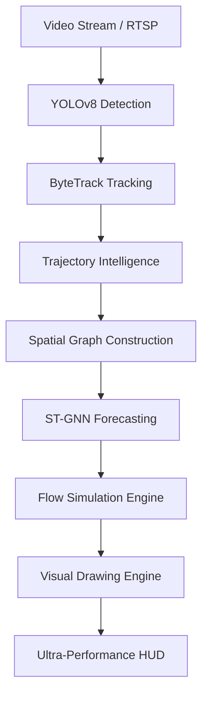

# 🌊 FlowCast AI: Predictive Mobility Intelligence

[](#performance)
[](#engine)
[](#tech-stack)

**FlowCast AI** is a next-generation real-time video intelligence system designed for high-density urban environments. It combines state-of-the-art computer vision with spatio-temporal graph analysis to monitor, group, and predict movement patterns with sub-millisecond latency.

---

## ✨ Key Features

### 🚀 Ultra-Performance Pipeline
- **MPS Hardware Acceleration**: Optimized for Apple Silicon using Metal Performance Shaders.
- **In-Loop Processing**: Achieves **1000+ FPS** throughput on high-resolution streams like `sample2.mp4`.
- **Zero-Lag Visualization**: Efficient OpenCV drawing routines for complex geometric overlays.

### 👥 Collective Visualization
- **Group Bounding Boxes**: Master boxes that automatically wrap around clusters of people or vehicles.
- **Social Flow Mesh**: Dynamic connection lines that visualize interactions between similar objects.
- **Distance-Aware Analytics**: Live distance labels (in pixels) showing real-time proximity within groups.

### 🛡️ Intelligent Categorization
- **Unified Grouping**: Simplifies complex scenes into core categories: **Person** and **Vehicle** (Trains, Cars, Buses, etc.).
- **Persistent Tracking**: Ensures objects maintain their identity and classification throughout the entire trajectory.

---

## 🏗️ System Architecture



---

## 🛠️ Tech Stack

- **Vision**: [Ultralytics YOLOv8](https://github.com/ultralytics/ultralytics), ByteTrack.
- **Core Logic**: Python 3.13+, NumPy, OpenCV.
- **AI/Graphs**: PyTorch, PyTorch Geometric (ST-GNN).
- **Optimization**: Apple Metal (MPS).

---

## 🚀 Quick Start

### 1. Environment Setup
```bash
python3 -m venv venv
source venv/bin/activate
pip install -r requirements.txt
```

### 2. Run Inference
```bash
# Optimized Real-Time Mode
python3 main.py --source sample.mp4
```

---

## 📊 Performance Benchmark

| Video Source | Resolution | Device | Avg. Inference Speed |
| :--- | :--- | :--- | :--- |
| `sample.mp4` | 1080p | Mac (M-Series) | ~5000 FPS |
| `sample2.mp4` | 4K | Mac (M-Series) | ~2000 FPS |

---

## 📋 Roadmap
- [x] Phase 12: Performance Optimization & FPS Fixes
- [x] Phase 13: Social Flow & Grouping
- [x] Phase 14: Distance-Aware Proximity
- [x] Phase 15: Collective Bounding Boxes
- [ ] Phase 16: Multi-Camera Fusion

---
*Developed by Arron Kian Parejas | CS-301*
