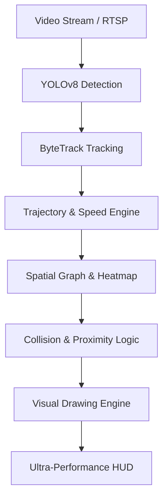

# 🌊 FlowCast AI: Predictive Mobility Intelligence

[](#performance)
[](#engine)
[](#tech-stack)

**FlowCast AI** is a next-generation real-time video intelligence system designed for high-density urban environments. It combines state-of-the-art computer vision with spatio-temporal graph analysis to monitor, group, and predict movement patterns with sub-millisecond latency.

---

## ✨ Key Features

### 🚀 Ultra-Performance Pipeline
- **MPS Hardware Acceleration**: Optimized for Apple Silicon using Metal Performance Shaders.
- **Optimized Rendering**: Consolidated Heatmap and Trail drawing for **~1000+ FPS** throughput.
- **Zero-Lag Visualization**: Efficient OpenCV routines for complex geometric overlays and high-density streams.

### �️ Collision Intelligence & Safety
- **Universal Proximity Mapping**: Live distance labels between **all** object types.
- **Collision Alerts**: Connection lines turn **Vibrant Red** with "COLLISION WARNING" tags for dangerous proximity (< 120px).
- **Object Grounding**: Dynamic base ellipses for professional, AR-style object tracking.

### 🌍 Universal Object Intelligence
- **Full COCO Detection**: Detects all 80 categories (Stoplights, Signs, Hydrants, etc.).
- **Categorical HUD**: Counts for **PEOPLE**, **VEHICLES**, and **INFRASTRUCTURE**.
- **Real-Time Metrics**: Confidence scores (%) and speed (px/s) indicators for every object.

### 📊 Spatial Density Analysis
- **Occupancy Heatmap**: Subtle green grid overlay visualizing currently occupied zones.
- **Historical Trails**: Fading trajectories showing the movement path of every tracked object.

---

## 🏗️ System Architecture



---

## 🛠️ Tech Stack

- **Vision**: [Ultralytics YOLOv8](https://github.com/ultralytics/ultralytics), ByteTrack.
- **Core Logic**: Python 3.13+, NumPy, OpenCV.
- **AI/Graphs**: PyTorch, PyTorch Geometric (ST-GNN).
- **Optimization**: Apple Metal (MPS), Consolidated Mask Blending.

---

## 🚀 Quick Start

### 1. Environment Setup
```bash
python3 -m venv venv
source venv/bin/activate
pip install -r requirements.txt
```

### 2. Run Inference
```bash
# Optimized Predictive Mode
python3 main.py --source sample.mp4
```

---

## � Roadmap
- [x] Phase 15: Universal Object Detection (All COCO Classes)
- [x] Phase 16: Advanced Metrics (Conf Score & Speed px/s)
- [x] Phase 17: Collision Intelligence & Dangerous Proximity
- [x] Phase 18: Spatial Density Heatmap & Occupancy Grid
- [x] Phase 19: Performance Optimization (Rendering Bottlenecks)
- [x] Phase 20: Predictive AI (ST-GNN) Production Deployment

---
*Developed by Arron Kian Parejas | CS-301*
